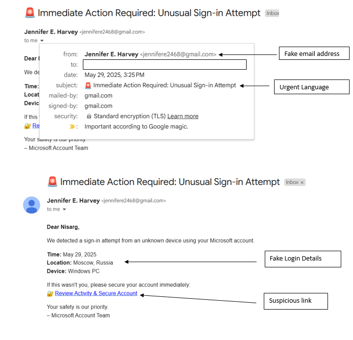

# Elab_Day_2
# 🛡️ Internship Task: Phishing Email Analysis

## 📌 Overview

This task involves identifying and analyzing suspicious characteristics of phishing emails targeting unsuspecting users. Two sample emails — one pretending to be from Microsoft and another from Mastercard — were reviewed to demonstrate common phishing tactics used by attackers.

---

## 📧 Sample Email 1: Microsoft Account Phishing

### Email Subject:
🚨 Immediate Action Required: Unusual Sign-in Attempt

### Key Indicators of Phishing:
- **🕵️‍♂️ Fake Email Address:** The sender email (`jennifere2468@gmail.com`) does not match Microsoft’s official domain.
- **⚠️ Urgent Language:** Phrases like “Immediate Action Required” are used to trigger panic and force quick action.
- **🌍 Fake Login Details:** Claims of a sign-in from “Moscow, Russia” on “Windows PC” to create fear.
- **🔗 Suspicious Link:** The “Review Activity & Secure Account” link is designed to capture user credentials.

---

## 📧 Sample Email 2: Mastercard Phishing

### Email Subject:
🔒 Action Required: Mandatory Password Reset Notification

### Key Indicators of Phishing:
- **📬 Impersonated Sender:** Poses as "IT Security Team" using a likely spoofed or fake email (`it-security@mastercard.com`).
- **⏱️ Expiry Warning:** States the link will expire in 60 minutes, pushing urgency.
- **🔗 Misleading Link:** “Reset Password Securely” is designed to lure the recipient into entering sensitive information.

---

## 🎯 Objective

To recognize and annotate common red flags found in phishing emails including:
- Mismatched sender addresses
- Urgent and alarming language
- Requests for personal information or credential resets
- Suspicious-looking links
- Fake login activity details

---

## ✅ Outcome

This analysis helps improve awareness around phishing email structures, making it easier for users and organizations to identify potential threats and avoid compromising sensitive data.

---
